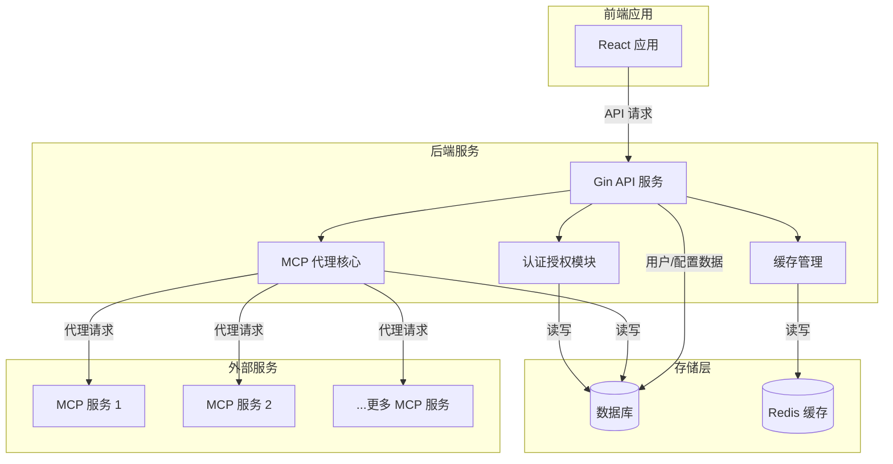
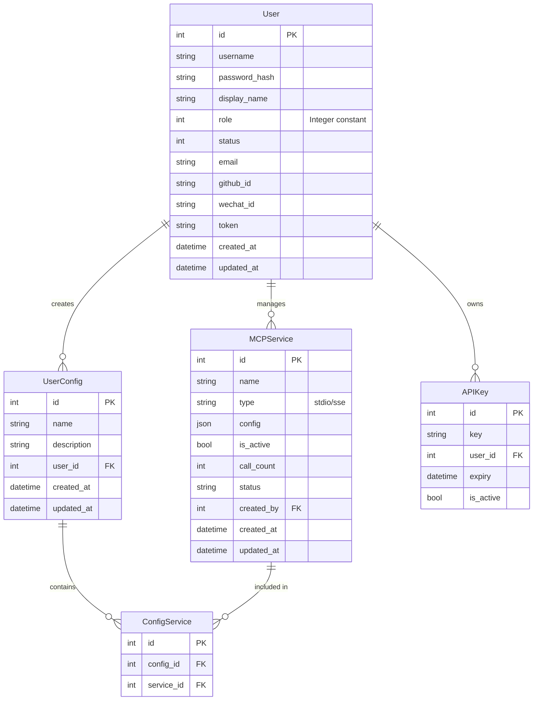
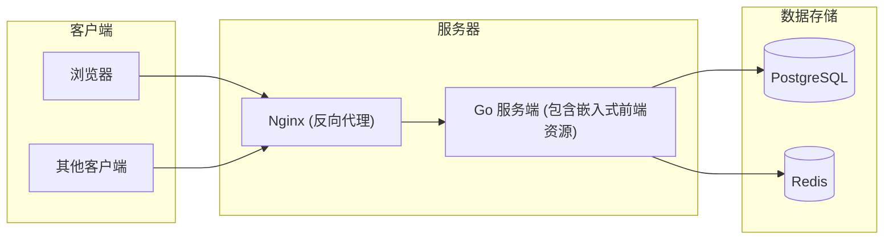

# One MCP 服务技术架构文档

## 1. 系统架构概述

### 1.1 整体架构

One MCP 服务采用现代化的前后端分离架构，由以下主要部分组成：



### 1.2 技术栈选择

| 层级 | 技术选择 | 说明 |
|------|---------|------|
| 前端 | React + Tailwind CSS | 提供现代化、响应式的用户界面，Tailwind CSS 支持快速开发与维护 |
| 后端 | Golang + Gin + GORM | 高性能后端服务，Gin 提供轻量级 Web 框架，GORM 简化数据库操作 |
| 数据库 | SQLite / PostgreSQL | 开发环境使用 SQLite 简化配置，生产环境可切换至 PostgreSQL 提高并发性能 |
| 缓存 | Redis | 提供高性能缓存服务，支持会话管理、API响应缓存等 |

## 2. 前端架构

### 2.1 技术选型详情

- **核心框架**: React 
- **状态管理**: React Context + Hooks
- **路由**: React Router
- **样式**: Tailwind CSS
- **UI组件库**: Headless UI
- **HTTP客户端**: Axios
- **构建工具**: 与 gin-template 集成，前端资源最终编译并嵌入到 Go 可执行文件中

### 2.2 目录结构

```
web/
├── public/                  # 静态资源
├── src/
│   ├── assets/              # 图片、字体等资源
│   │   ├── css/             # CSS 样式文件 (含 Tailwind)
│   │   ├── js/              # JavaScript 文件
│   │   └── images/          # 图片资源
│   ├── components/          # React 组件
│   │   ├── common/          # 通用组件
│   │   ├── layout/          # 布局组件
│   │   └── ui/              # UI组件 (使用 Headless UI)
│   ├── contexts/            # React Context
│   ├── hooks/               # 自定义钩子
│   ├── pages/               # 页面组件
│   │   ├── auth/            # 认证相关页面
│   │   ├── dashboard/       # 仪表盘页面
│   │   ├── services/        # MCP服务管理页面
│   │   └── configs/         # 配置管理页面
│   ├── templates/           # 模板文件（若需要与 gin-template 结合）
│   ├── utils/               # 工具函数
│   ├── App.jsx              # 应用入口
│   └── index.jsx            # 根组件
├── package.json             # 依赖配置
└── tailwind.config.js       # Tailwind 配置
```

### 2.3 主要页面和功能

- **登录/注册页**: 利用 gin-template 已有的认证功能框架，使用 React 和 Tailwind CSS 升级 UI
- **首页/仪表盘**: 概览统计数据，展示已安装的 MCP 服务和调用统计
- **MCP 服务列表**: 展示已配置的服务，提供启用/禁用开关和配置复制功能
- **配置管理**: 用户创建和管理的配置组合
- **用户管理** (管理员): 用户账号管理，基于 gin-template 功能，使用 React 和 Tailwind CSS 改进界面
- **系统设置** (管理员): 全局配置管理

## 3. 后端架构

### 3.1 技术选型详情

- **语言**: Go 1.21+
- **Web框架**: Gin
- **ORM**: GORM
- **数据库驱动**: sqlite3 / pgx (PostgreSQL)
- **缓存**: go-redis
- **认证**: JWT + bcrypt
- **配置管理**: viper
- **日志**: zap
- **依赖注入**: wire (可选)

### 3.2 目录结构

```
backend/
│   ├── config/              # 配置相关
│   ├── model/               # 数据模型定义 (Model)
│   ├── api/                 # API 处理器 (Controller)
│   │   ├── handler/         # HTTP 处理器
│   │   ├── middleware/      # 中间件
│   │   └── route/           # 路由定义
│   ├── service/             # 业务逻辑服务
│   ├── common/              # 通用工具、常量、日志等
│   ├── library/             # 外部库集成
├── web/                     # 前端相关 (View)
│   ├── src/                 # React 源代码
│   └── build/               # 构建后的前端资源
├── migrations/              # 数据库迁移
├── .env                     # 环境变量
├── go.mod                   # Go 模块定义
└── go.sum                   # 依赖校验和
```

同时，在项目根目录下有以下文件：

```
├── main.go                  # 主程序入口
├── go.mod                   # Go 模块定义
├── go.sum                   # 依赖校验和
├── .env                     # 环境变量
├── .gitignore               # Git 忽略文件配置
├── Dockerfile               # Docker 构建文件
├── LICENSE                  # 许可证文件
└── README.md                # 项目说明文档
```

### 3.3 主要模块

#### 3.3.1 Model 层

- 数据模型定义 (`model/`)
- 数据库操作 (CRUD)
- GORM 模型和数据库映射

#### 3.3.2 Controller 层

- API 处理器 (`api/handler/`)
- 路由定义 (`api/route/`)
- 中间件 (`api/middleware/`)
- 请求验证和响应格式化

#### 3.3.3 View 层

- React 前端应用 (`web/`)
- 组件和页面
- API 集成
- 用户界面渲染

#### 3.3.4 Service 层 (业务逻辑)

- 业务规则和应用逻辑 (`service/`)
- 跨多个 Model 的复杂操作
- MCP 服务核心逻辑

#### 3.3.5 辅助模块

- 配置管理 (`config/`)
- 通用工具 (`common/`)
- 外部库集成 (`library/`)

## 4. 数据库设计

### 4.1 实体关系图



### 4.2 主要表设计

#### 用户相关表

| 用户表 (users) |
|---------------|
| id            |
| username (unique, size:12)      |
| password (size:100, not null) |
| display_name (index, size:20) |
| role (int, default:1) |
| status (int, default:1) |
| email (index, size:50) |
| github_id (index) |
| wechat_id (index) |
| token (index) |
| created_at    |
| updated_at    |

注意：User模型也包含一个VerificationCode字段，但它被标记为`gorm:"-:all"`，表示不保存到数据库中。

#### MCP服务相关表

| MCP服务表 (mcp_services) |
|------------------------|
| id                     |
| name                   |
| type                   |
| config                 |
| is_active              |
| call_count             |
| created_at             |
| updated_at             |
| created_by             |

#### 配置相关表

| 用户配置表 (user_configs) |
|------------------------|
| id                     |
| name                   |
| description            |
| user_id                |
| created_at             |
| updated_at             |

| 配置服务关系表 (config_services) |
|------------------------------|
| id                           |
| config_id                    |
| service_id                   |

## 5. API 设计

### 5.1 认证 API

| 端点 | 方法 | 描述 | 参数 | 响应 |
|------|-----|------|------|------|
| `/api/auth/login` | POST | 用户登录 | username, password | token, refresh_token, user_info |
| `/api/auth/logout` | POST | 用户登出（客户端删除令牌） | - | success |
| `/api/auth/refresh` | POST | 刷新令牌 | refresh_token | new_token, new_refresh_token |
| `/api/auth/register` | POST | 用户注册 | username, password, email, captcha | token, user_info |
| `/api/auth/captcha` | GET | 获取验证码 | - | captcha_id, captcha_image |

### 5.2 用户管理 API

| 端点 | 方法 | 描述 | 权限 |
|------|-----|------|------|
| `/api/users` | GET | 获取用户列表 | Admin |
| `/api/users` | POST | 创建新用户 | Admin |
| `/api/users/:id` | GET | 获取单个用户 | Admin/Self |
| `/api/users/:id` | PUT | 更新用户 | Admin/Self |
| `/api/users/:id` | DELETE | 删除用户 | Admin |
| `/api/users/:id/reset-password` | POST | 重置密码 | Admin |

### 5.3 MCP 服务管理 API

| 端点 | 方法 | 描述 | 权限 |
|------|-----|------|------|
| `/api/services` | GET | 获取服务列表 | All |
| `/api/services` | POST | 创建新服务 | Admin |
| `/api/services/:id` | GET | 获取单个服务 | All |
| `/api/services/:id` | PUT | 更新服务 | Admin |
| `/api/services/:id` | DELETE | 删除服务 | Admin |
| `/api/services/:id/toggle` | POST | 启用/禁用服务 | Admin |
| `/api/services/:id/config/:client` | GET | 获取特定客户端配置 | All |

### 5.4 用户配置管理 API

| 端点 | 方法 | 描述 | 权限 |
|------|-----|------|------|
| `/api/configs` | GET | 获取配置列表 | Self |
| `/api/configs` | POST | 创建新配置 | All |
| `/api/configs/:id` | GET | 获取单个配置 | Self |
| `/api/configs/:id` | PUT | 更新配置 | Self |
| `/api/configs/:id` | DELETE | 删除配置 | Self |
| `/api/configs/:id/:client` | GET | 导出特定客户端配置 | Self |

## 6. 缓存策略

### 6.1 缓存内容

- **JWT 黑名单**: 存储已注销的 JWT 令牌
- **验证码**: 存储生成的验证码
- **API 响应**: 缓存频繁请求但不常变化的数据 (如服务列表)
- **MCP 服务状态**: 缓存健康检查结果
- **配置文件**: 缓存已生成的客户端配置

### 6.2 缓存键设计

| 缓存类型 | 键模式 | 过期时间 |
|---------|-------|---------|
| JWT 黑名单 | `jwt:blacklist:{token_id}` | 与令牌过期时间一致 |
| 验证码 | `captcha:{captcha_id}` | 5分钟 |
| 服务列表 | `services:list` | 5分钟 |
| 服务配置 | `service:{id}:config:{client}` | 10分钟 |
| 用户配置 | `user:{id}:config:{config_id}:{client}` | 10分钟 |

## 7. 部署架构

### 7.1 开发环境

- 前端: 与 gin-template 集成，`npm run dev` 用于开发时监听变更
- 后端: `go run main.go`
- 数据库: SQLite
- 缓存: 本地 Redis 实例

### 7.2 生产环境



### 7.3 容器化部署

提供 Docker Compose 配置，包含以下服务：

- Go 服务端 (包含嵌入式前端资源，单一可执行文件)
- PostgreSQL
- Redis

示例 `docker-compose.yml`:

```yaml
version: '3'
services:
  server:
    build: .
    environment:
      - DB_HOST=postgres
      - DB_NAME=one-mcp
      - DB_USER=postgres
      - DB_PASSWORD=password
      - REDIS_HOST=redis
    ports:
      - "8080:8080"
    depends_on:
      - postgres
      - redis
  
  postgres:
    image: postgres:14
    environment:
      - POSTGRES_USER=postgres
      - POSTGRES_PASSWORD=password
      - POSTGRES_DB=one-mcp
    volumes:
      - postgres_data:/var/lib/postgresql/data
  
  redis:
    image: redis:7
    volumes:
      - redis_data:/data

volumes:
  postgres_data:
  redis_data:
```

## 8. 安全考虑

### 8.1 认证与授权

- 使用 JWT 进行无状态认证
- 密码加密存储 (bcrypt)
- 基于角色的访问控制 (RBAC)
- API 请求速率限制

### 8.2 数据安全

- 传输加密 (HTTPS)
- 敏感配置信息加密存储
- API 密钥定期轮换机制
- 配置文件数据验证

## 9. 开发流程与工具

### 9.1 版本控制

- Git + GitHub/GitLab
- 分支策略: GitHub Flow (主分支 + 功能分支)

### 9.2 CI/CD

- GitHub Actions / GitLab CI
- 自动测试、构建和部署流程

### 9.3 测试策略

- 前端: Jest + React Testing Library
- 后端: Go 标准测试库 + testify
- API测试: Postman / REST Client

### 9.4 构建过程

- 前端资源使用 npm/yarn 进行构建，生成静态文件
- 构建过程中使用 Go 的 embed 功能将前端资源嵌入到后端可执行文件中
- 最终生成单一可执行文件，简化部署和维护

## 10. 性能与可扩展性考虑

### 10.1 性能优化

- API 响应缓存
- 数据库索引优化
- 前端资源压缩与懒加载

### 10.2 可扩展性设计

- 模块化架构
- 水平扩展支持
- 配置外部化

### 10.3 监控与日志

- 应用性能监控 (APM)
- 结构化日志
- 错误跟踪 