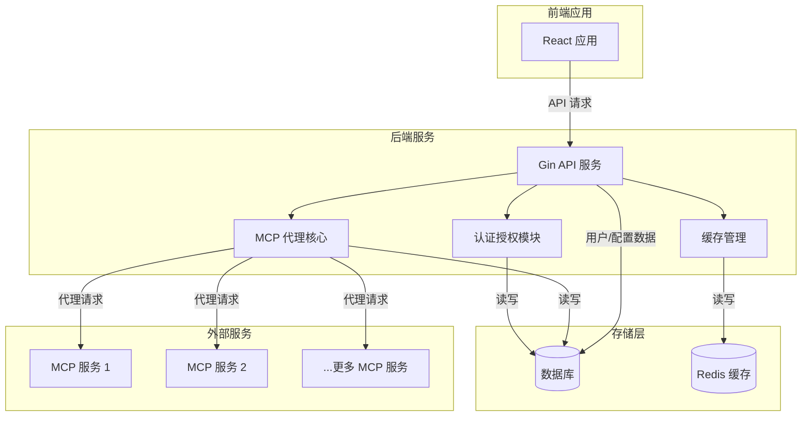
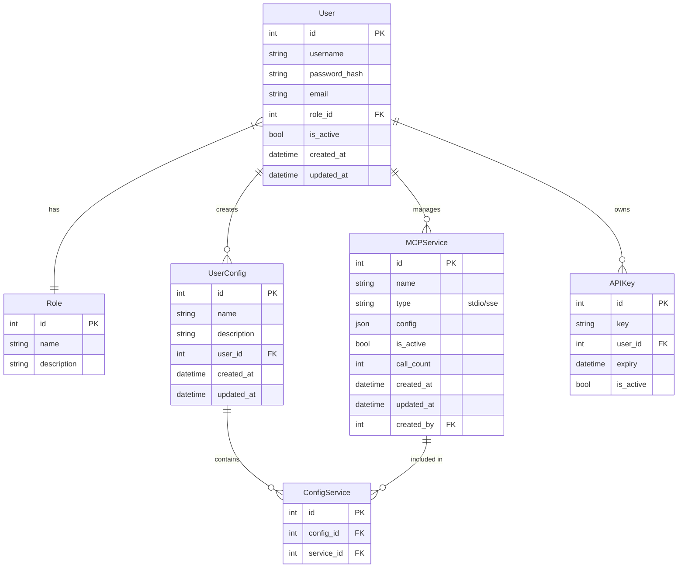
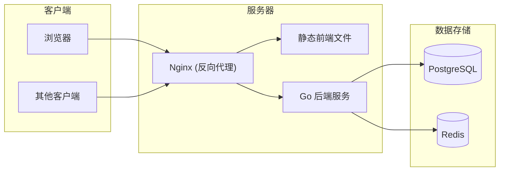

# MCP 代理服务技术架构文档

## 1. 系统架构概述

### 1.1 整体架构

MCP 代理服务采用现代化的前后端分离架构，由以下主要部分组成：



### 1.2 技术栈选择

| 层级 | 技术选择 | 说明 |
|------|---------|------|
| 前端 | React + Tailwind CSS | 提供现代化、响应式的用户界面，Tailwind CSS 支持快速开发与维护 |
| 后端 | Golang + Gin + GORM | 高性能后端服务，Gin 提供轻量级 Web 框架，GORM 简化数据库操作 |
| 数据库 | SQLite / PostgreSQL | 开发环境使用 SQLite 简化配置，生产环境可切换至 PostgreSQL 提高并发性能 |
| 缓存 | Redis | 提供高性能缓存服务，支持会话管理、API响应缓存等 |

## 2. 前端架构

### 2.1 技术选型详情

- **核心框架**: React 18+
- **状态管理**: React Context + Hooks
- **路由**: React Router
- **样式**: Tailwind CSS
- **UI组件库**: Headless UI
- **HTTP客户端**: Axios
- **构建工具**: Vite

### 2.2 目录结构

```
frontend/
├── public/                  # 静态资源
├── src/
│   ├── assets/              # 图片、字体等资源
│   │   ├── common/          # 通用组件
│   │   ├── layout/          # 布局组件
│   │   └── ui/              # UI组件
│   ├── contexts/            # React Context
│   ├── hooks/               # 自定义钩子
│   ├── pages/               # 页面组件
│   │   ├── auth/            # 认证相关页面
│   │   ├── dashboard/       # 仪表盘页面
│   │   ├── services/        # MCP服务管理页面
│   │   └── configs/         # 配置管理页面
│   ├── services/            # API调用服务
│   ├── utils/               # 工具函数
│   ├── App.jsx              # 应用入口
│   ├── index.jsx            # 根组件
│   └── routes.jsx           # 路由配置
├── .env                     # 环境变量
└── package.json             # 依赖配置
```

### 2.3 主要页面和功能

- **登录/注册页**: 用户认证入口
- **首页/仪表盘**: 概览统计数据，展示已安装的 MCP 服务和调用统计
- **MCP 服务列表**: 展示已配置的服务，提供启用/禁用开关和配置复制功能
- **配置管理**: 用户创建和管理的配置组合
- **用户管理** (管理员): 用户账号管理
- **系统设置** (管理员): 全局配置管理

## 3. 后端架构

### 3.1 技术选型详情

- **语言**: Go 1.21+
- **Web框架**: Gin
- **ORM**: GORM
- **数据库驱动**: sqlite3 / pgx (PostgreSQL)
- **缓存**: go-redis
- **认证**: JWT + bcrypt
- **配置管理**: viper
- **日志**: zap
- **依赖注入**: wire (可选)

### 3.2 目录结构

```
backend/
├── cmd/
│   └── server/              # 服务启动入口
├── config/                  # 配置相关
├── internal/
│   ├── api/                 # API 处理器
│   │   ├── handlers/        # HTTP 处理器
│   │   ├── middlewares/     # 中间件
│   │   └── routes/          # 路由定义
│   ├── auth/                # 认证授权相关
│   ├── cache/               # 缓存管理
│   ├── domain/              # 领域模型和业务逻辑
│   │   ├── entity/          # 实体定义
│   │   ├── repository/      # 数据访问接口
│   │   ├── service/         # 业务服务
│   │   └── dto/             # 数据传输对象
│   ├── infrastructure/      # 基础设施
│   │   ├── persistence/     # 持久化实现
│   │   └── proxy/           # MCP 代理实现
│   └── utils/               # 工具函数
├── migrations/              # 数据库迁移
├── pkg/                     # 可重用包
├── .env                     # 环境变量
├── go.mod                   # Go 模块定义
└── go.sum                   # 依赖校验和
```

### 3.3 主要模块

#### 3.3.1 API 模块

处理 HTTP 请求和响应，API 路由定义。主要路由组：

- `/api/auth`: 认证相关接口
- `/api/users`: 用户管理接口
- `/api/services`: MCP 服务管理接口
- `/api/configs`: 用户配置组合管理接口
- `/api/settings`: 系统设置接口

#### 3.3.2 认证授权模块

- JWT 令牌生成和验证
- 用户密码加密和验证
- 角色和权限管理

#### 3.3.3 MCP 代理核心模块

- MCP 服务连接管理
- 请求转发与聚合
- 服务健康检查

#### 3.3.4 缓存管理模块

- API 响应缓存
- 会话管理
- 配置缓存

## 4. 数据库设计

### 4.1 实体关系图



### 4.2 主要表设计

#### 用户相关表

| 用户表 (users) |
|---------------|
| id            |
| username      |
| password_hash |
| email         |
| role_id       |
| is_active     |
| created_at    |
| updated_at    |

| 角色表 (roles) |
|---------------|
| id            |
| name          |
| description   |

#### MCP服务相关表

| MCP服务表 (mcp_services) |
|------------------------|
| id                     |
| name                   |
| type                   |
| config                 |
| is_active              |
| call_count             |
| created_at             |
| updated_at             |
| created_by             |

#### 配置相关表

| 用户配置表 (user_configs) |
|------------------------|
| id                     |
| name                   |
| description            |
| user_id                |
| created_at             |
| updated_at             |

| 配置服务关系表 (config_services) |
|------------------------------|
| id                           |
| config_id                    |
| service_id                   |

## 5. API 设计

### 5.1 认证 API

| 端点 | 方法 | 描述 | 参数 | 响应 |
|------|-----|------|------|------|
| `/api/auth/login` | POST | 用户登录 | username, password | token, user_info |
| `/api/auth/logout` | POST | 用户登出 | token | success |
| `/api/auth/refresh` | POST | 刷新令牌 | refresh_token | new_token |

### 5.2 用户管理 API

| 端点 | 方法 | 描述 | 权限 |
|------|-----|------|------|
| `/api/users` | GET | 获取用户列表 | Admin |
| `/api/users` | POST | 创建新用户 | Admin |
| `/api/users/:id` | GET | 获取单个用户 | Admin/Self |
| `/api/users/:id` | PUT | 更新用户 | Admin/Self |
| `/api/users/:id` | DELETE | 删除用户 | Admin |
| `/api/users/:id/reset-password` | POST | 重置密码 | Admin |

### 5.3 MCP 服务管理 API

| 端点 | 方法 | 描述 | 权限 |
|------|-----|------|------|
| `/api/services` | GET | 获取服务列表 | All |
| `/api/services` | POST | 创建新服务 | Admin |
| `/api/services/:id` | GET | 获取单个服务 | All |
| `/api/services/:id` | PUT | 更新服务 | Admin |
| `/api/services/:id` | DELETE | 删除服务 | Admin |
| `/api/services/:id/toggle` | POST | 启用/禁用服务 | Admin |
| `/api/services/:id/config/:client` | GET | 获取特定客户端配置 | All |

### 5.4 用户配置管理 API

| 端点 | 方法 | 描述 | 权限 |
|------|-----|------|------|
| `/api/configs` | GET | 获取配置列表 | Self |
| `/api/configs` | POST | 创建新配置 | All |
| `/api/configs/:id` | GET | 获取单个配置 | Self |
| `/api/configs/:id` | PUT | 更新配置 | Self |
| `/api/configs/:id` | DELETE | 删除配置 | Self |
| `/api/configs/:id/:client` | GET | 导出特定客户端配置 | Self |

## 6. 缓存策略

### 6.1 缓存内容

- **用户会话**: 存储用户登录状态和权限信息
- **API 响应**: 缓存频繁请求但不常变化的数据 (如服务列表)
- **MCP 服务状态**: 缓存健康检查结果
- **配置文件**: 缓存已生成的客户端配置

### 6.2 缓存键设计

| 缓存类型 | 键模式 | 过期时间 |
|---------|-------|---------|
| 用户会话 | `session:{token}` | 24小时 |
| 服务列表 | `services:list` | 5分钟 |
| 服务配置 | `service:{id}:config:{client}` | 10分钟 |
| 用户配置 | `user:{id}:config:{config_id}:{client}` | 10分钟 |

## 7. 部署架构

### 7.1 开发环境

- 前端: `npm run dev` (Vite 开发服务器)
- 后端: `go run cmd/server/main.go`
- 数据库: SQLite
- 缓存: 本地 Redis 实例

### 7.2 生产环境



### 7.3 容器化部署

提供 Docker Compose 配置，包含以下服务：

- 前端 (Nginx 服务静态文件)
- 后端 API
- PostgreSQL
- Redis

示例 `docker-compose.yml`:

```yaml
version: '3'
services:
  frontend:
    build: ./frontend
    ports:
      - "80:80"
    depends_on:
      - backend
  
  backend:
    build: ./backend
    environment:
      - DB_HOST=postgres
      - DB_NAME=mcpproxy
      - DB_USER=postgres
      - DB_PASSWORD=password
      - REDIS_HOST=redis
    ports:
      - "8080:8080"
    depends_on:
      - postgres
      - redis
  
  postgres:
    image: postgres:14
    environment:
      - POSTGRES_USER=postgres
      - POSTGRES_PASSWORD=password
      - POSTGRES_DB=mcpproxy
    volumes:
      - postgres_data:/var/lib/postgresql/data
  
  redis:
    image: redis:7
    volumes:
      - redis_data:/data

volumes:
  postgres_data:
  redis_data:
```

## 8. 安全考虑

### 8.1 认证与授权

- 使用 JWT 进行无状态认证
- 密码加密存储 (bcrypt)
- 基于角色的访问控制 (RBAC)
- API 请求速率限制

### 8.2 数据安全

- 传输加密 (HTTPS)
- 敏感配置信息加密存储
- API 密钥定期轮换机制
- 配置文件数据验证

## 9. 开发流程与工具

### 9.1 版本控制

- Git + GitHub/GitLab
- 分支策略: GitHub Flow (主分支 + 功能分支)

### 9.2 CI/CD

- GitHub Actions / GitLab CI
- 自动测试、构建和部署流程

### 9.3 测试策略

- 前端: Jest + React Testing Library
- 后端: Go 标准测试库 + testify
- API测试: Postman / REST Client

## 10. 性能与可扩展性考虑

### 10.1 性能优化

- API 响应缓存
- 数据库索引优化
- 前端资源压缩与懒加载

### 10.2 可扩展性设计

- 模块化架构
- 水平扩展支持
- 配置外部化

### 10.3 监控与日志

- 应用性能监控 (APM)
- 结构化日志
- 错误跟踪 